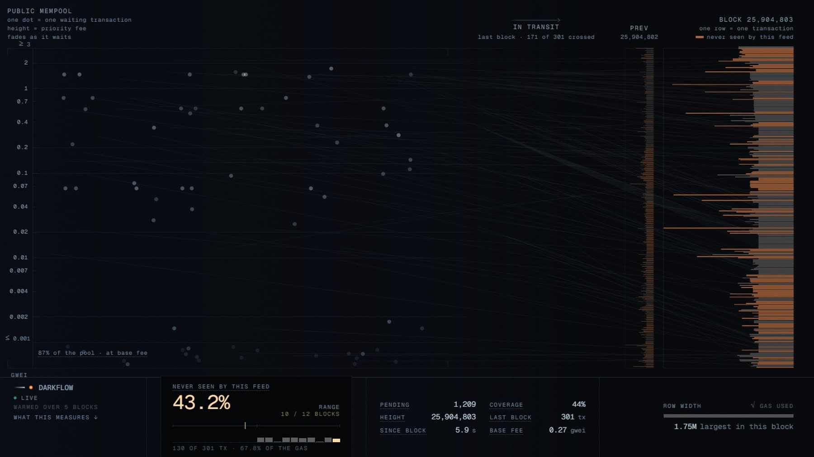

# DARKFLOW

Watch the Ethereum mempool live, and see which transactions land in a block
without ever having been announced to it.

**[darkflow.martincasais.com](https://darkflow.martincasais.com)**



## What you are looking at

The left side is the public mempool as one endpoint hears it. Every dot is a
transaction waiting to be included, sitting at the height of the fee it
offers and fading the longer it waits. The right side is the latest block,
one row per transaction, as wide as the gas it used.

Every twelve seconds a block lands. The transactions the feed had already
heard fly from the pool to their row. The ones it had never heard just appear
in their row, with no trajectory, in the one warm colour the page uses for
nothing else. The panel counts them: *never seen by this feed*. In the
screenshot above that is 130 of 301. On mainnet it is about half of every
block, most days.

That number is the reason the site exists. Those transactions reached the
block through private channels: builder bundles, private relays, MEV
infrastructure, order flow sold before it was ever public. Everyone in the
space knows this happens. I wanted to see it happen, block by block, at the
size it actually is.

## What the number means, and what it does not

"Never seen by this feed" is exactly that: this feed, one public endpoint,
did not hear the transaction before it was included. It is an upper bound on
private flow from one vantage point. It also catches whatever propagation
simply missed, transactions that waited longer than the five minutes the page
remembers, and anything that arrived during the cold start.

So the page measures its own blind spot. For every block, the ingest counts
how many rows it had heard first, and shows the share on the panel as
COVERAGE. It runs around 45 to 55 percent. When I pointed a second public
feed with three times the announcements at the same blocks, the union of the
two heard one point more. Whatever is left unheard is not the feed being deaf.
It is private.

Some rules the instrument keeps, because the failure mode of a project like
this is a picture that looks right and is not:

- Nothing is shown before the data supports it. The first five blocks after
  connecting are a warm-up; the headline is blank, not zero.
- A block whose receipts cannot be fetched is not drawn with gaps. It is not
  drawn, and the miss is counted.
- Every row, announced or not, sits at the fee it actually paid, read from its
  receipt. A private transaction is not placed at the floor because its bid is
  unknown; its bid is known, from the block.
- The status dot always says what you are looking at: `live`, a recording, or
  the generator. The three are never mixed.
- If the live feed dies, the page falls back to a recording of mainnet after a
  minute, says so, and offers a way back.

## How it is built

Two packages, one wire contract between them (`web/types/stream.ts`).

`web/` is a Next.js app with a single `<canvas>`. The simulation is a pure
function, `step(state, dt, now)`, driven by one animation loop, and React is
kept out of the hot path entirely: it renders the chrome a few times a second
from sampled readings. Every visual constant in it was calibrated in pixels.
The fee axis is logarithmic and rescales with the market. Hover any legend and
it tells you what it means. Tap a row on a phone and the inspector opens as a
sheet. A governor watches both the average frame rate and the slowest frame in
each window and cuts the render budget when either says the device is
struggling.

`ingest/` is the server half, with no server. It is a core the web's own route
handlers import and run inside the site's functions: one WebSocket subscription
to PublicNode for pending transactions and heads, one `eth_getBlockReceipts`
per block, frames batched at 10 Hz, replay from the last minute when a page
reconnects, and its own coverage measured on every block. Zero runtime
dependencies. It subscribes when the first page arrives and unsubscribes a
minute after the last one leaves, because nobody is watching this all day and
nothing should run all day.

Why a public endpoint and not a paid one: every metered provider prices the
mempool by message or by byte, and the mempool is the biggest stream the chain
has. At a modest 25 transactions a second the cheapest of them came to about a
thousand dollars a month. PublicNode delivers full pending transactions,
heads and receipts for free and without a key; I measured it before choosing
it, and the two probe scripts that produced those numbers are in
`ingest/scripts/`.

## Running it

```bash
cd web
cp .env.example .env.local
pnpm install
pnpm dev
```

The source is picked at build time. `synthetic` is a seeded generator with the
shape of mainnet traffic, the default, and what everything was calibrated
against. `replay` plays the recording in `public/replay/` at its own pace.
`sse` is the live feed: `/api/stream` when `UPSTREAM_WS_URL` is set, or
`scripts/fake-ingest.mjs` when you want the live path without a network.

To deploy, one Vercel project with Root Directory `web` and four environment
variables. The ingest runs inside the site's functions and reads the same
environment, so there is nothing else to deploy.

```
NEXT_PUBLIC_STREAM_SOURCE=sse
NEXT_PUBLIC_INGEST_URL=/api/stream
NEXT_PUBLIC_REPLAY_URL=replay/mainnet-2026-09-03.json   # or empty: no fallback
UPSTREAM_WS_URL=wss://ethereum-rpc.publicnode.com        # server-side
```

Everything else has a default and is explained in `web/.env.example`.

`pnpm lint`, `pnpm build` and `pnpm test` in each package. 394 tests in the
web, 57 in the ingest, and the ones that matter are checked with mutants: a
test that stays green when the code it guards is broken is not a test. CI runs
all of it on every push.

## Notes

Most of what went wrong in this project went wrong quietly. An alpha that was
`NaN` and silently switched off fading for months of screenshots. A block
shuffled "for realism" that destroyed the fee ordering it sat next to. A build
gate that read the output lines it expected and called a failing build green
for hours. No one reported any of them. Each was found by measuring something
that looked fine.

There are eighteen of those, written up with what the screen showed, why
nothing flagged it and how it was caught, at
[darkflow.martincasais.com/notes](https://darkflow.martincasais.com/notes).
The same page has the five working rules that came out of them and the
numbers the feed had to produce before it could be called live.

## The recording

`web/public/replay/mainnet-2026-09-03.json` is five minutes of mainnet from
the afternoon of 2026-09-03: blocks 25,897,732 to 25,897,756, all twenty-five
of them, 7,807 transactions heard from two public endpoints, and every row
with the tip it paid. It is what the page plays when the live feed is gone,
and what `NEXT_PUBLIC_STREAM_SOURCE=replay` plays on purpose. `pnpm capture`
in `web/` records another one.

---

[Martín Casais](https://martincasais.com) · [@casaisdev](https://x.com/casaisdev)
